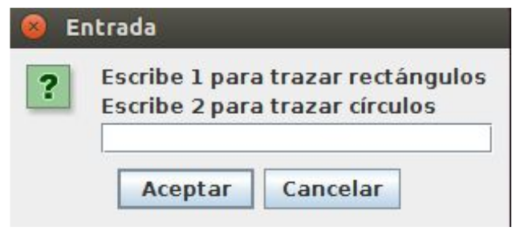
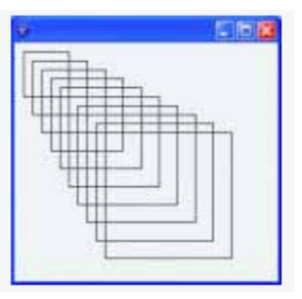
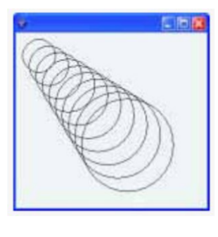

# Practica 07

## Interfaces graficas

### Actividad 1

Mediante el trazado de líneas visto en clase, realiza una figura como la siguiente:

### Actividad 2

Un programa que realice lo siguiente:
1. Preguntar mediante un cuadro de diálogo que se quiere dibujar, si rectángulos o círculos.

2. Si la opción seleccionada es 1 debe mostrar:

3. Si la opción seleccionada es 2 debe mostrar:

