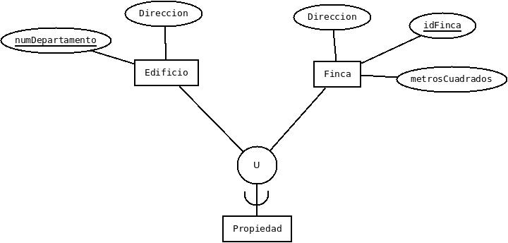
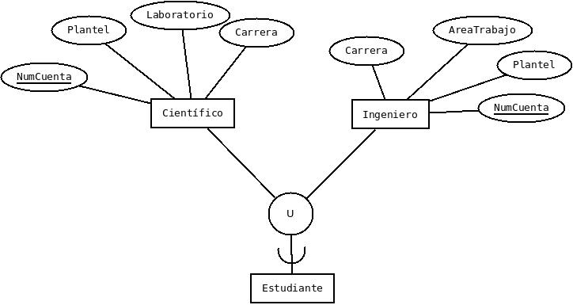
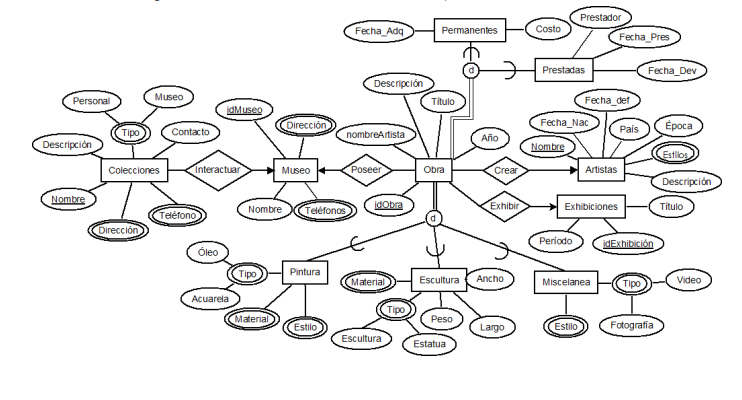
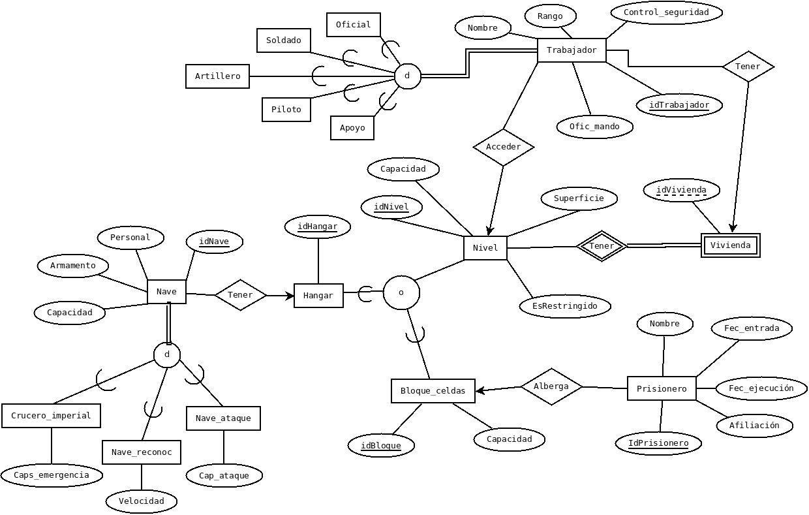

####1. Preguntas de repaso

**a. ¿Qué es una relación y que características tiene?**

Una relación es una asociación entre entidades, matemáticamente hablando: Si A y B son conjuntos, una relación R es un subconjunto de AxB.

**b. ¿Qué es un esquema de relación?**

La relación es representada en el modelo con un rombo que une a dos entidades, ya sea una entidad fuerte o si es una entidad débil es un rombo con un rombo mas pequeño dentro de el, esto se une a las entidades a través de las restricciones de participación y cardinalidad.

**c. ¿Qué es una llave primaria? ¿Qué es una llave candidata? ¿Qué es una llave mínima? ¿Qué es una super llave?**

**Llave primaria:** Registro que permite identificar tuplas de la relación de forma única, ya que no se repite.

**Llave candidata:** Aquella lave que no ha sido escogida como llave primaria pero que también podría identificar de manera única a la tupla.

**Llave mínima:** Es una llave candidata que no involucra más de un atributo 

**Super llave:** Cualquier conjunto de atributos cuyos valores no se repiten en tuplas distintias de la relación.

 **d. ¿Qué restricciones impone una llave primaria y una llave foránea al modelo de datos relacional?**

**Restricciones llave primaria:** Lá unica restricción que necesita la llave primaria es que sea un valor que no debe en ningún otro registro de la columna.

**Restricciones llave foránea:**

Sean R es una relación  B una entidad, una llave foránea es un subconjunto FK de B tal que:

- Existe una relacion A con una llave FK.
- Cada valor de FK en B es idéntico al valor de FK en alguna tupla de A.

La Base de datos no debe contener valores de la llave externa que no se correspondan a un valor de la llave candidata (Es decir, si B referencia a A, entonces A debe de existir).

**e. Investiga como se traducen las categorías (presentes en el modelo E/R) al modelo relacional. Proporciona un ejemplo.**

Si las superclases de la categoría tienen distintas llaves primarias:

1. Se crea una relación R que corresponda a la categoría y se le asigna una llave sustituta arbitraria.
2. Se añade la llave sustituta como llave foránea en cada una de las relaciones Ri que corresponden a las superclases de la categoría.

Ejemplo:

Edificio(<u>numDepartamento</u>, Direccion, idDueño, idPropiedad)

Finca(<u>idFinca</u>, Direccion, MetrosCuadrados)

Propiedad(<u>idPropiedad</u>)

Si las superclases de la categoría tienen la misma llave primaria:

1. Se crea una relación R que corresponda a la categoría y se le asigna como atributo llave primaria la llave común a todas las superclases de la categoría.

Científico(<u>NumCuenta</u>, Plantel, Laboratorio, Carrera)

Ingeniero(<u>NumCuenta</u>, Plantel, AreaTrabajo, Plantel)

Estudiante(<u>NumCuenta</u>)

#### 2. Modelo Relacional

**Traduce el siguiente modelo Entidad/Relacion a su correspondiente Modelo Relacional.**

Colecciones(<u>Nombre</u>, Descripción, Tipo, Contacto, Direccion, Teléfono, idMuseo)

TipoColecciones(<u>Nombre</u>, Personal, Museo)

DireccionColecciones(<u>Nombre</u>, Direccion)

TelefonoColecciones(<u>Nombre</u>, Telefono)

Museo(<u>idMuseo</u>, Nombre, Dirección, Telefonos)

DireccionMuseo(<u>idMuseo</u>, Direccion)

Telefono(<u>idMuseo</u>, Telefono)

Obra(<u>idObra</u>, Título, nombreArtista, Descripción, Año, idMuseo, NombreArtista, idExhibición)

Pintura(<u>idObra</u>, Título, nombreArtista, Descripción, Año, Estilo, Tipo, Material)

EstiloPintura(<u>idObra</u>, Estilo)

MaterialPintura(<u>idObra</u>, Material)

TipoPintura(<u>idObra</u>, Oleo, Acuarela)

Escultura(<u>idObra</u>, Título, nombreArtista, Descripción, Año, Material, Tipo, Peso, Largo, Ancho)

MaterialEscultura(<u>idObra</u>, Material)

TipoEscultura(<u>idObra</u>, Escultura, Estatua)

Miscelanea(<u>idObra</u>, Título, nombreArtista, Descripción, Año, Estilo, Tipo)

MiscelaneaEstilo(<u>idObra</u>, Estilo)

MiscelaneaTipo(<u>idObra</u>, Fotografía, Video)

Permanentes(<u>idObra</u>, Título, nombreArtista, Descripción, Año, Fecha_Adq, Costo)

Prestadas(<u>idObra</u>, Título, nombreArtista, Descripción, Año, Prestador, Fecha_Pres, Fecha_Dev)

Artistas(<u>Nombre</u>, Fecha_Nac, Fecha_def, Descripción, Estilos, País, Época, Estilos)

EstilosArtista(<u>NombreArtista</u>, Estilo)

Exhibiciones(<u>idExhibición</u>, Título, Periodo)

#### 3. Modelo Relacional

**Traduce a su correspondiente Modelo Relacional, el problema de la Estrella de la Muerte (Tarea 2). Si realizaste alguna modificación a tu diseño original (para mejorarlo), indica los cambios hechos y la justificación de los mismos.**

Se modificó la participación de varias entidades, ya que estas podían causar ambiguedades, seguido de esto se agregó y mejoró la cardinalidad de las mismas. Por último se cambiaron las relaciones entre Nivel, Nave y Bloque_celdas, ya que estas no tienen relacion, si no que los niveles pueden ser un Bloque de celdas o un Hangar (Se agregó esta entidad para poder almacenar las naves),

**En cualquier caso, deberás mostrar el diagrama E/R y su correspondiente traducción. Es importante que muestres tanto las restricciones de entidada como las de integridad referencial.**

Trabajador(<u>idTrabajador</u>, Nombre, Rango, Control_seguridad, Ofic_mando, idNivel, idVivienda)

Oficial(<u>idTrabajador</u>, Nombre, Rango, Control_seguridad, Ofic_mando, idNivel, idVivienda)

Soldado(<u>idTrabajador</u>, Nombre, Rango, Control_seguridad, Ofic_mando, idNivel, idVivienda)

Piloto(<u>idTrabajador</u>, Nombre, Rango, Control_seguridad, Ofic_mando, idNivel, idVivienda)

Apoyo(<u>idTrabajador</u>, Nombre, Rango, Control_seguridad, Ofic_mando, idNivel, idVivienda)

Vivienda(<u>idVivienda</u>)

Nivel(<u>idNivel</u>, Capacidad, Superficie, EsRestringido, EsHangar, EsBloque_Celdas, idVivienda)

Hangar(<u>idHangar</u>)

Nave(<u>idNave</u>, idHangar, Personal, Armamento, Capacidad)

BloqueCeldas(idBloque, Capacidad)

Prisionero(<u>idPrisionero</u>, Nombre, Fec_entrada, Fec_ejecucion, Afiliación, idBloque)

####4. Lectura

**Leer el artículo Codd's 12 Rules for an RDBMS. Explica con tus propias palabras cada una de las 12 reglas de Codd.**

**Regla 1 - Regla de la información: **Toda la información en las bases de datos relacionales es representada solamente por tablas. Y en general los servidores SQL acatan esta regla, dado que no pueden almacenar información en otra cosa que no sea una tabla. No es posible almacenar datos en variables como en los lenguajes de programación.

**Regla 2 - Regla de acceso garantizado: ** Todos y cada uno de los valores atómicos debe ser accesible mediante una combinación del nombre de la tabla, su llave primaria y el nombre de la columna. Usando SQL, podemos buscar la llave primaria (la cual debe ser única),una vez tengamos la fila, se accede a los datos a través del nombre de la columna.

**Regla 3 - Tratamiento sistemático de los valores nulos: ** Los valores nulos (diferentes de vacio), deben ser soportados en los Sistemas Manejadores de Bases de Datos Relacionales ya que estos también pueden representar información, como valores desconocidos. 

Existen dos configuraciones especiales para manejar valores nulos en servidores SQL: ANSI_NULL y CONCAT_NULL_YIELDS, configuraciones derivadas de malas prácticas que eran permitidas en versiones anteriores de los servidores SQL.

**Regla 4 - Catálogo Dinámico en Línea Basado en el Modelo Relacional: ** La descripción de la base de datos es representada de la misma manera que los datos en el nivel lógico. Esta regla nos dice que es necesario que una base de datos relacional sea auto-descriptiva, es decir, que labase de datos debe contener ciertas tablas cuyas columnas describen la estructura de la base de datos. Esta regla se empezó a utilizar con la implementación de un nuevo esquema que tiene un conjunto de vistas para ver gran parte de los metadatos de las tablas, las relaciones y el código en la base de datos.

**Regla 5 - Regla de sublenguaje en datos completos: ** Un Sistema Manejador de Bases de Datos Relacional puede soportar varios lenguajes y varios modos de uso de terminales. Pero debe de haber al menos un lenguaje cuyas declaraciones tengan sintaxis bien definida.

Esto quiere decir que debe existir un lenguaje para manejar la base de datos relacional, como SQL, el cual debe poder soportar todas las funciones de un Sistema Manejador de Bases de Datos, introducción y recuperación de datos, asi como su implementación y seguridad.

**Regla 6 - Regla de actualización: ** Las vistas son tablas virtuales utilizadas para dar a diferentes usuarios de una base de datos diferente vistas de su estructura. Una vista es, teóricamente, actualizable siempre y cuando se componga de columnas que correspondan directamente a las columnas reales de la tabla.

**Regla 7 - Inserción, actualización y eliminación de alto nivel: ** Esta regla nos dice que en una base de datos relacional, las filas tienen que ser tratadas como conjutnos para que puedan soportar las opciones de inserción, actualización y eliminación. Esto se diseño para prohibir implementaciones que soporte solo una fila a la vez. SQL cubre esto a través de las instrucciones INSERT, UPDATE y DELETE.

**Regla 8 - Independencia de datos físicos: ** Las aplicaciones deben seguir funcionando con la misma sintaxis, incluso cuando se realizan cambios en la forma en que la base de datos implementa su almacenamiento de datos y métodos de acceso, esto implica que la forma en que los datos se almacenan fisicamente debe ser indepentiende de la manera lógica en la que se accede. 

Esto quiere decir que los usuarios no deben preocuparse por como se almacenan los datos o como se acceden a ellos, solo necesitan ser capaces de obtener la definición de los datos que necesitan.

**Regla 9 - Independencia de datos lógicos: ** Junto con la regla anterior, esta aisla al usuario o la aplicación de la implementación de bajo nivel de la base de datos. especifica que las técnicas específicas de acceso, almacenamiento  e incluso cambios en la estructura del Sistema de Base de Datos Relacional no debería afectar la capacidad de trabajar con los datos para el usuario.

**Regla 10 - Independencia de la integridad: ** Dice que las restricciones de integridad específicas de una base de datos relacional particular deben definirse en el sublenguaje de datos relacional y pueda ser almacenable en el catálogo y no en los programas y aplicaciones.

La base de datos debe soportar al menos las siguientes dos restricciones de integridad:

- Integridad de entidad: No se permite que ningun dato que sea llave primaria tenga valor NULL.
- Integridad referencial: Para cada valor distinto en la llave foránea distinto de NULL en una base de datos relacional, debe existir una llave primaria del mismo dominio.

Esta regla dice que el lenguaje de la base de datos debe soportar restricciones de integridad para los datos que pueden ser introducidos. El Sistema Manejador de Base de Datos Relacional debe cumplir la integridad de entidad y referencial.

**Regla 11 - Independencia de la distribución: ** El lenguaje de la base de datos debe ser capaz de manipular los datos ubicados en otro sistema, deben de ser capaces de dividir los datos del Sistema Manejador de Base de Datos Relacional en múltiples sistemas físicos sin que el usuario se percate de ello.

**Regla 12 - Regla de no suberversión: ** Si un sistema relacional soporta un lenguaje de bajo nivel este no puede usarse para subvertir (hacer que deje de tener el orden normal) ni desviar las reglas de integridad mencionadas anteriormente.

Los métodos alternativos para acceder a los datos no pueden omitir las restricciones de integridad, asi los usuarios no pueden violar las reglas de la base de datos, sin embargo SQL Server 2008 puede violar esta regla mediante la copia masiva para insertar datos y deshabilitando las restricciones y los 'triggers'.

**Indica por qué consideras que son importantes y si, hasta el momento de los comentado en el curso sería posible que un SMBD pudiera cumplir enteramente con lo que ahí se propone.**

Las 12 reglas de Cood, a pesar de que están enfocadas hacia SQL Server nos muestran las bases y reglas a seguir en un SMBD para que este pueda ser de tipo Relacional. 

Se que un SMBD (o SMBDR como lo llamarían las reglas) sería posible, hace falta conseguir las optimizaciones y normalizaciones necesarias para que las restricciones y las independencias puedan satisfacerse.

#### Bibliografía

- Material del Curso: Fundamentos de Bases de Datos 2018-1 - Gerardo Avilés Rosas, José Enrique Vargas Benitez. Consultado el: 7 Septiembre, 2018.
- Codd's 12 Rules for an RDBMS - Edgar F. Codd. Consultado el: 9 Septiembre, 2018

